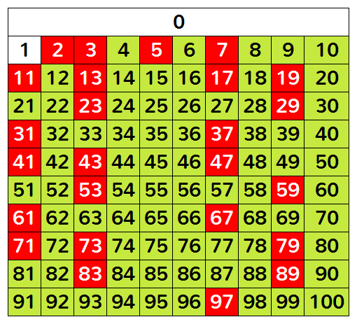

# Ejercicio Ciclos

En [matemáticas](https://es.wikipedia.org/wiki/Matemáticas), un **número primo** es un [número natural](https://es.wikipedia.org/wiki/Número_natural) mayor que 1 que tiene únicamente dos [divisores](https://es.wikipedia.org/wiki/Divisibilidad) positivos distintos: él mismo y el [1](https://es.wikipedia.org/wiki/Uno)

Fuente : [https://es.wikipedia.org/wiki/N%C3%BAmero_primo](https://es.wikipedia.org/wiki/Número_primo)

Escribe un programa en python llamado **primo.py**

Escribe una función llamada es_primo que reciba un número y que regrese **True** o **False** dependiendo si el número es primo o no.

Tome en cuenta la definción de como encontrar un número primo definido al inicio.

Su función es_primo debe usar **<u>ciclos</u>**.

Para probarlo ejecute el programa **test.py** proporcionado

A continaución se muestran los números primos entre 1 y 100

